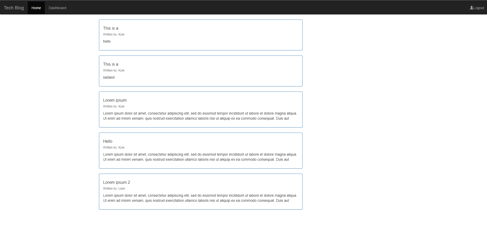

# Tech-Blog


## Application Picture
 

## Technologies Used 
    - Javascript - Used to write the functions of the application. 
    - Express - Used Router to create paths between files.
    - Git - Version control system to track changes to source code.
    - GitHub - Hosts repository that can be deployed to GitHub pages.
    - Handlebars - Template framework for setting up the front end html.

## Summary 
    Developed a full stack application from the ground up. This application will allow you to make several requests to the database and will save current sessions. This particular application is a blog site where users can log in and post blogs as well as comment on them. 


## Code Snippet
    In the code snippet below, is our get router to grab a specific post and render the page. This is only allowed if the user is logged in.(withAuth) is the function where we check if the user is signed in.

```
router.get('/blog/:id', withAuth, async(req, res) => {
    try {
        const blogData = await Blog.findByPk(req.params.id, {
            include: [
                {
                    model: User,
                    attribute: ['username']
                },
            ],
        });
        const blog = blogData.get({ plain: true});
        const commentData = await Comment.findAll({ where: {blog_id: blog.id}}, {
            include: [
                {
                    model: User,
                    attribute: ['username']
                },
            ],
        });
        const comment = commentData.map((data) => data.get({ plain: true}));
        res.render('oneblog', {
            blog,
            comment,
            logged_in: req.session.loggedIn
        });
    } catch (err) {
        res.status(500).json(err);
    }
}); 
```


## Author Links
[LinkedIn](https://www.linkedin.com/in/liamsctewart/)<br>
[Github](https://github.com/LiamStewart8)<br>